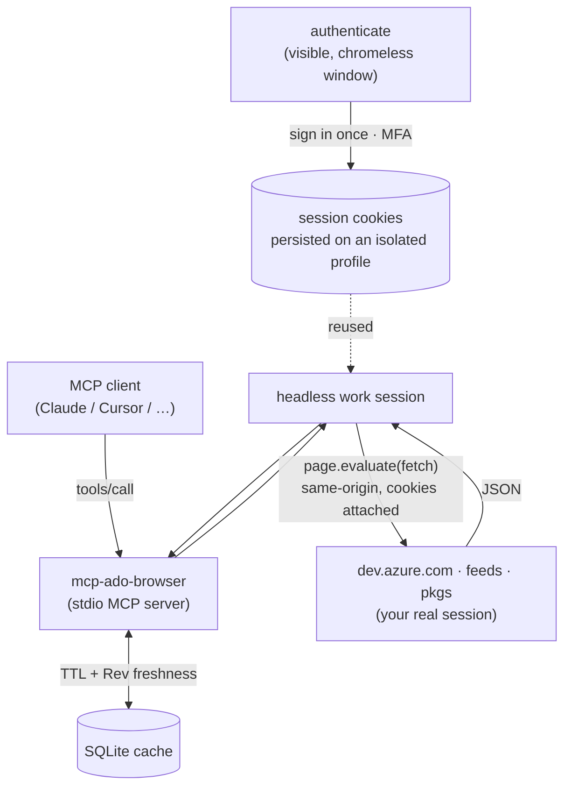

# mcp-ado-browser

> Azure DevOps for MCP — via your browser, not a PAT.

An **MCP (stdio) server** that gives **read-only access to Azure DevOps using only your
existing browser session** — **no PAT, no Azure CLI, no official ADO MCP**, no
credential provider. The only source of authentication is the cookie session of a real
browser, driven by Playwright on an **isolated, dedicated profile**.

It is **org-wide by default**: only the organization is required, and it browses **every
project, repo and feed you can access**.

Data is fetched via `page.evaluate(() => fetch(...))` executed **inside the
`dev.azure.com` page context** (same-origin), so session cookies attach automatically
and you get **JSON** back — never DOM scraping for data the REST API provides. Every
request carries `X-TFS-FedAuthRedirect: Suppress` so a dead session returns a clean
`401` instead of an HTML login page.

## Why these choices (restricted-environment friendly)

| Concern | Decision |
|---|---|
| No Playwright browser download | `playwright-core` + `channel: 'chrome'`/`'msedge'` uses an already-installed browser; nothing is downloaded. |
| SQLite without a native build | `node:sqlite` (built into Node ≥ 22.5) — zero compilation. |
| One package, one binary | The MCP server and the `authenticate` mechanism ship in the same package and the same `npx` binary. |
| No hardcoded values | org/project/ids come from flags/env or discovery; api-versions live only in `src/ado/versions.ts`. |

## How it works



1. **Authentication is your browser, not a token.** `authenticate` opens a real,
   visible browser window on a **dedicated, isolated profile** (never your daily
   browser). You sign in normally (MFA included). The tool detects success by polling
   an authenticated endpoint, then persists the session cookies on disk. No PAT or
   token is ever created or stored.
2. **Work runs headless.** Subsequent runs launch the same profile **headless** and
   reuse the persisted cookies — no window, no re-login until the session expires.
3. **Data comes back as JSON, not scraped HTML.** Each tool runs
   `fetch(...)` **inside the `dev.azure.com` page context** (same-origin), so the
   session cookies attach automatically. Every request sends
   `X-TFS-FedAuthRedirect: Suppress`, so an expired session returns a clean `401`
   (surfaced as a structured `AUTH_REQUIRED` error) instead of an HTML login page.
   Cross-host services (feeds / packages) use the same browser cookie jar.
4. **Responses are cached** in a local SQLite DB (`node:sqlite`) with a configurable
   TTL. On a stale hit, a cheap freshness check (`System.Rev` for work items) avoids
   re-downloading unchanged data.
5. **When the session dies**, tools fail fast with `AUTH_REQUIRED` — just re-run
   `authenticate` and continue.

## Getting started

**Prerequisites:** Node ≥ 22.5 and Google Chrome (or Microsoft Edge) installed. You do
**not** need a PAT, the Azure CLI, or any admin setup.

Setup is **two steps**:

1. **Register the server** in your MCP client (one config entry — see your client below).
2. **Sign in once** — just ask your assistant: *“authenticate to Azure DevOps”*. The
   built-in `authenticate` tool opens a visible browser window; you log in (MFA), and the
   session is persisted. (No separate terminal command needed.) From then on everything
   runs headless until the session expires — then just ask it to authenticate again.

The command every client runs is the same:

```bash
npx -y mcp-ado-browser --org <your-org>
```

Config is passed as CLI flags (`--org`, `--project`, …) or env vars (`ADO_ORG`, …);
flags win. Then ask things like *“list my active pull requests”*, *“show work item 1234
and its linked PR”*, or *“what feeds and packages are in this org?”*.

> Tip: prefer per-user/local config (not committed) so your org name doesn't land in a
> shared repo. Or omit `--org` from a committed config and set `ADO_ORG` in your env.

## Use it from your MCP client

<details open>
<summary><b>Claude Code</b></summary>

```bash
claude mcp add ado --scope local -- npx -y mcp-ado-browser --org <your-org>
```
Then ask Claude to *“authenticate to Azure DevOps”*.
</details>

<details>
<summary><b>Claude Desktop</b> — <code>claude_desktop_config.json</code></summary>

```json
{
  "mcpServers": {
    "ado": {
      "command": "npx",
      "args": ["-y", "mcp-ado-browser", "--org", "<your-org>"]
    }
  }
}
```
</details>

<details>
<summary><b>GitHub Copilot (VS Code)</b> — <code>.vscode/mcp.json</code></summary>

```json
{
  "servers": {
    "ado": {
      "type": "stdio",
      "command": "npx",
      "args": ["-y", "mcp-ado-browser", "--org", "<your-org>"]
    }
  }
}
```
Open Copilot Chat in **Agent** mode and pick the `ado` tools. (Avoid committing your org —
use `${env:ADO_ORG}` or a personal config.)
</details>

<details>
<summary><b>Cursor</b> — <code>~/.cursor/mcp.json</code> (or <code>.cursor/mcp.json</code>)</summary>

```json
{
  "mcpServers": {
    "ado": {
      "command": "npx",
      "args": ["-y", "mcp-ado-browser", "--org", "<your-org>"]
    }
  }
}
```
</details>

<details>
<summary><b>Codex CLI</b> — <code>~/.codex/config.toml</code></summary>

```toml
[mcp_servers.ado]
command = "npx"
args = ["-y", "mcp-ado-browser", "--org", "<your-org>"]
```
</details>

After registering, trigger sign-in **from the chat** (*“authenticate to Azure DevOps”*),
which runs the `authenticate` tool. Prefer a terminal instead? `npx -y mcp-ado-browser
authenticate --org <your-org>` does the same thing. Tools return a structured
`AUTH_REQUIRED` error when the session expires — re-authenticate and continue.

## Tools (`tools/list`)

| Tool | What it does |
|---|---|
| `list_projects` | All projects you can access (org-wide). |
| `list_repositories` | All Git repos across the org (or one project). |
| `search_work_items` | WIQL (org-wide by default) or full-text (almsearch); `project` to scope. |
| `get_work_item` | Work item with `$expand=all` + `relations` (hierarchy, Related, PR ArtifactLink resolved). |
| `get_work_item_comments` | The separate comments endpoint (project derived automatically). |
| `get_comment_details` | A comment **plus** its downloaded attachments (size, sha256). |
| `search_pull_requests` | PRs org-wide, by repo, or by project; filter by status/author/target. |
| `get_pull_request` | Metadata, branches, reviewers, linked work items (repo by id **or name**). |
| `get_pull_request_comments` | Threads, distinguishing **system vs human**. |
| `search_feeds` | Artifacts feeds → packages → versions. |
| `download_artifact` | `.nupkg`/`.tgz` from a feed (cross-host `pkgs.dev.azure.com`), with archive-integrity validation. |
| `authenticate` | Opens a visible browser for interactive sign-in (MFA); persists the session. Run it once, or whenever a tool returns `AUTH_REQUIRED`. |

## Configuration

| Flag | Env | Default | Meaning |
|---|---|---|---|
| `--org` | `ADO_ORG` | — | Organization (**required**). |
| `--project` | `ADO_PROJECT` | — | Default project scope (optional; org-wide otherwise). |
| `--user-data-dir` | `ADO_USER_DATA_DIR` | `~/.mcp-ado-browser/profile` | Isolated persistent browser profile. |
| `--channel` | `ADO_BROWSER_CHANNEL` | `chrome` | `chrome` or `msedge`. |
| `--cache-ttl` | `ADO_CACHE_TTL_SECONDS` | `900` | Global cache TTL. Per-resource: `ADO_CACHE_TTL_WORKITEM=60`. |
| `--api-version` | `ADO_API_VERSION` | discovery/defaults | Force an api-version for all areas. |
| `--no-app-window` | `ADO_APP_WINDOW=0` | app mode | Use a normal browser window for sign-in. |
| `--headed` | `ADO_HEADLESS=0` | headless | Run work with a visible window. |

## Development & verification

```bash
npm install
npm run build
npm run verify           # all offline gates (browser stack, MCP, tools, cache, artifacts, no-hardcoding)
npm run verify:live      # adds the live acceptance pass against real Azure DevOps
npm run scan:secrets     # pre-push secret / sensitive-data scan
npm run demo:live        # drive the real stdio server as an MCP client (env-driven)
```

`npm run verify` prints a detailed report, gate by gate, assertion by assertion.
`BLOCKED_ON_AUTH` is transitory: the run is not done until the live pass is green; the
only tolerated terminal exclusion is `EMPIRICALLY_BLOCKED` (with evidence), for the
cross-host artifact download only.

## Security & privacy

- Authentication is **only** your real browser session on a dedicated, isolated profile
  — no PAT or token is ever created, stored, or transmitted by this tool.
- The session lives in `~/.mcp-ado-browser/profile` (machine-local, gitignored).
- Fixtures and reports are anonymized; `npm run scan:secrets` blocks pushes that would
  leak personal/org data or secrets (also enforced in CI).

## License

MIT © VMargan
